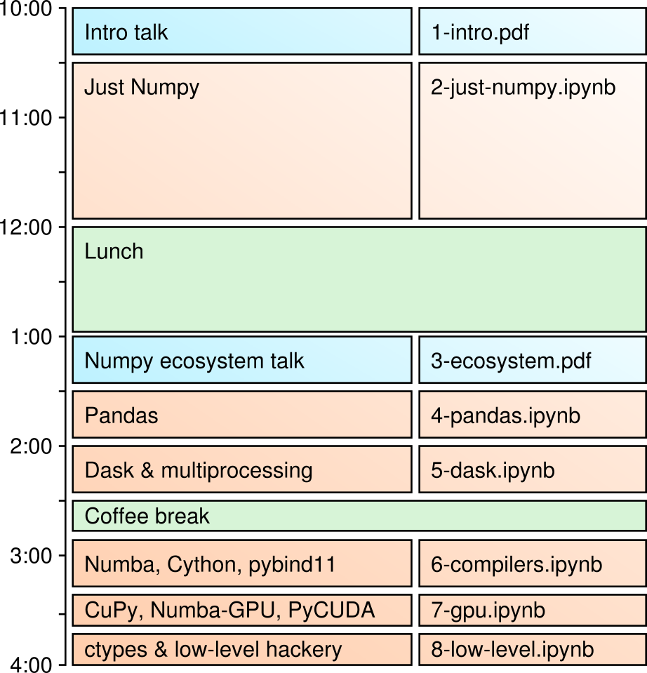

# Python/Numpy for High-Performance Numerical Processing

Notebooks and slides used for the [Numpy mini-course at Princeton](https://researchcomputing.princeton.edu/events/pythonnumpy-high-performance-numerical-processing) held November 15, 2018.

### Abstract

Python is a notoriously slow language, so why is it widely used by scientists and machine learning experts? In a numerically heavy task, an interpreted, dynamically typed environment can be thousands of times slower than a compiled, statically typed one, which can make the difference between minutes and days or between coarse models on small datasets and fine-grained models on large datasets. The trick is to drive compiled functions from the interpreted commandline, like R, and to frame your problem in array programming primitives, like Matlab, but in a general-purpose programming language with hundreds of thousands of extensions to glue to every conceivable interface.

In this workshop, we will examine the numerical processing ecosystem that has grown up around Python. The key library in this ecosystem is Numpy, which enables fast array programming, and Pandas, a convenient wrapper for organizing data. We will visualize data in and out of JupyterLab, a notebook front-end for exploratory analysis. We'll also work through examples of binding ~~from C++ to Python with pybind11 and~~ from Python to C++ with Cython, which have different strengths and use-cases. We'll also natively compile Python (C++ speeds without C++) using Numba and run code on GPUs with Numba (Python-like), CuPy (Numpy-like), and PyCUDA/PyOpenCL (raw CUDA/OpenCL).

Participants will be encouraged to bring a laptop or log into their favorite cluster to install the software we discuss here for later use. We will use conda and pip-in-conda, so superuser ("sudo") permissions are not required.

Jim Pivarski received his Ph.D. in high-energy particle physics from Cornell in 2006. He helped to commission the CMS experiment at the LHC and later switched to data science as a Big Data consultant. He is now back in physics, integrating computing techniques learned from industry into high-energy physics analysis.

### Plan for the day

General intention; we'll vary from this if there's good reason to do so.



### How to prepare

(1) Check out this repository:

```
git clone https://github.com/jpivarski/python-numpy-mini-course.git
```

(2) Install Anaconda or [Miniconda for Python 3](https://conda.io/miniconda.html). Using that, install Jupyter (Lab or Notebook; I prefer Lab):

```
conda install jupyterlab
```

Change directories into the repository and start Jupyter Lab or Notebook:

```
cd python-numpy-mini-course
jupyter lab                   # or notebook
```

Installations for the sessions are given at the top of each notebook, but if you want to install everything at once, instructions are collected below. Most of these are already bundled in the full Anaconda distribution.

```
conda install numpy                                 # 2-just-numpy
conda install pandas matplotlib                     # 4-pandas
conda install dask distrubted -c conda-forge        # 5-dask
conda install numba cython                          # 6-compilers
```

Don't bother installing softare for the GPU session if you don't have an NVidia GPU with the CUDA development kit installed.

```
conda install cupy cudatoolkit                      # 7-gpu
export CFLAGS=-fpermissive
pip install --no-cache-dir pycuda
```

(3) General Python programming skills will be assumed (ability to read or write a page-long script without difficulty). Walk through an online tutorial if you need to brush up before the course.

Knowedge of the libraries presented here _will not_ be assumed. Come and learn!

### Pre-evaluated notebooks

You'll get the most out of the course if you follow along in the blank notebooks in the master branch of this repository. However, if you're returning to look up a result, pre-evaluated copies of all the notebooks can be found on the [evaluated branch](https://github.com/jpivarski/python-numpy-mini-course/tree/evaluated) of this repository.
